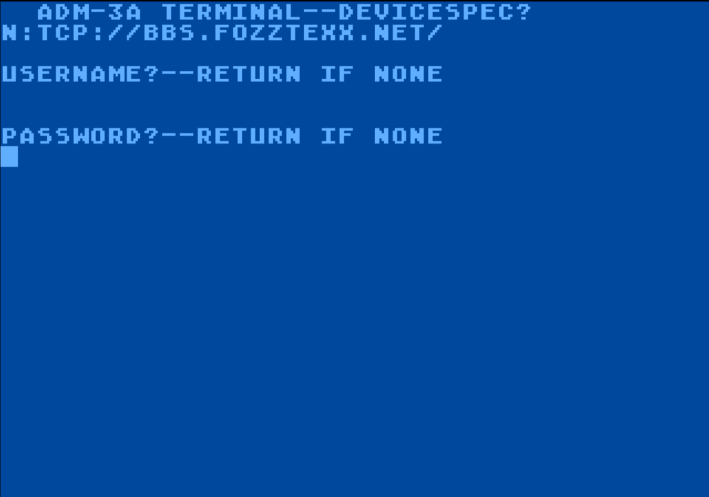
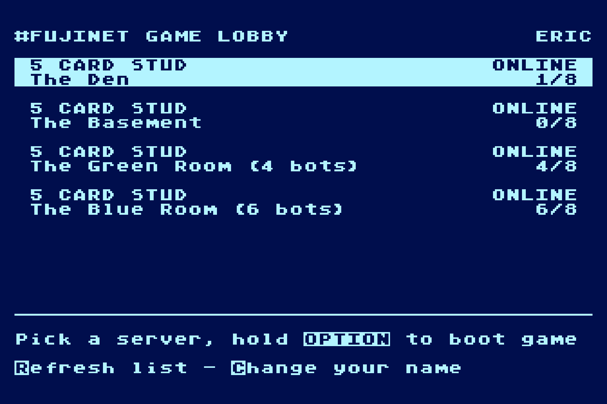
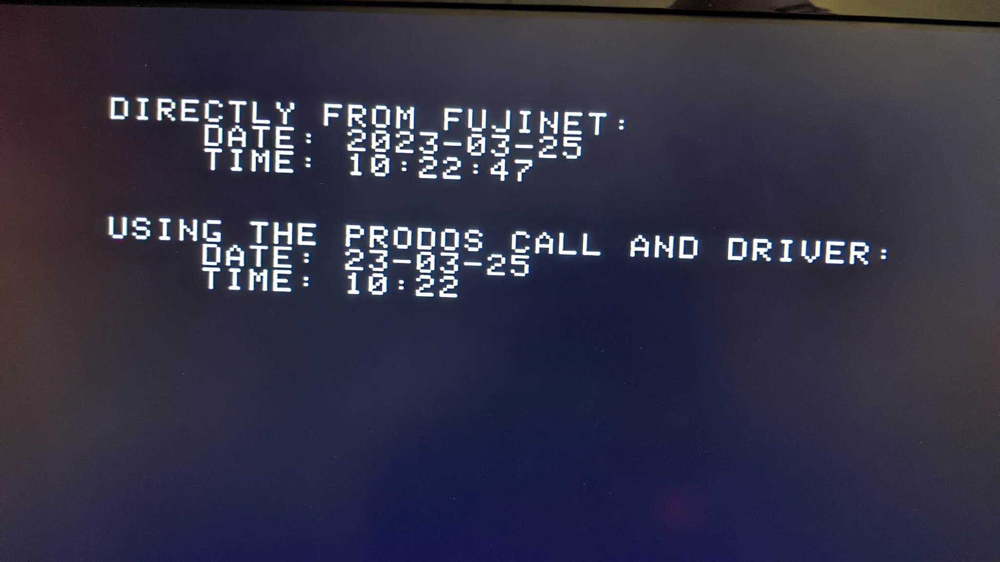
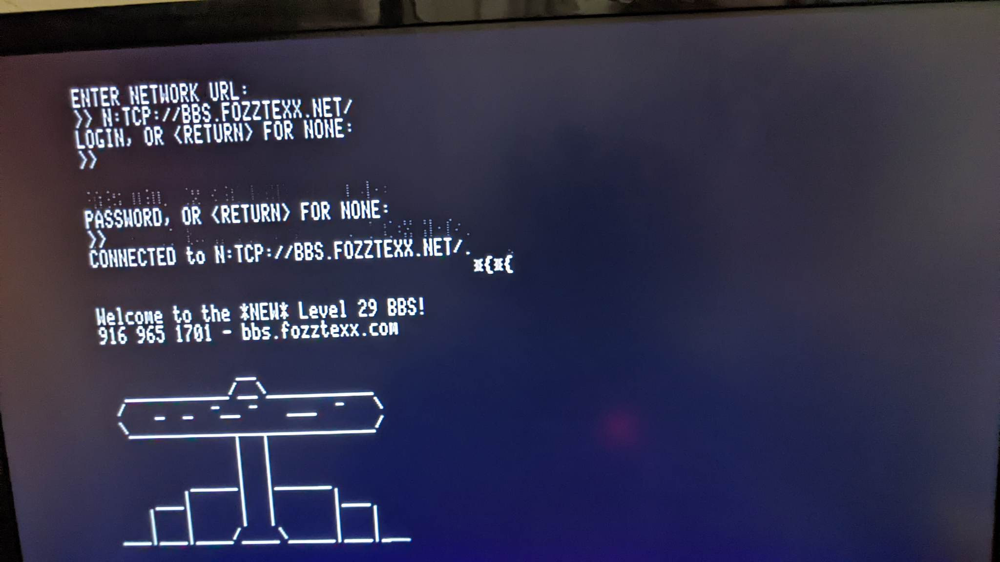
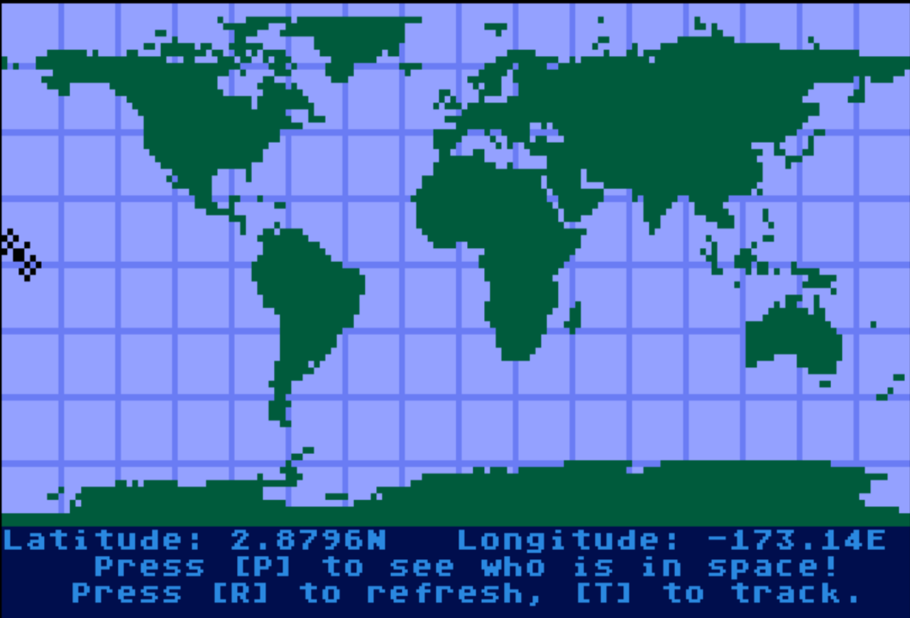
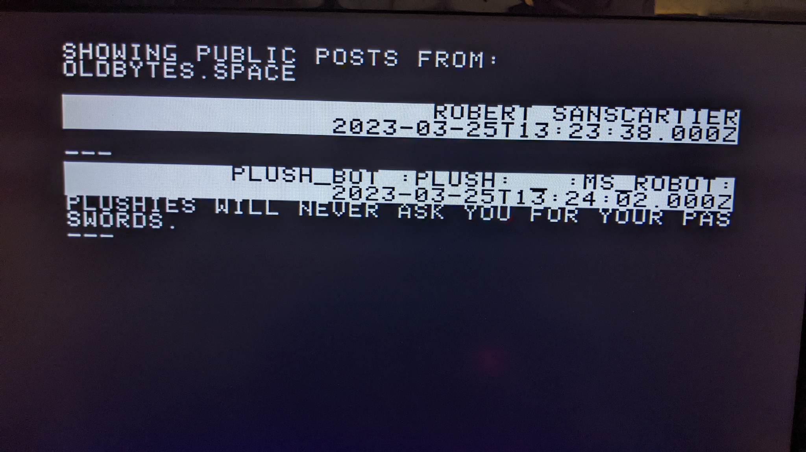
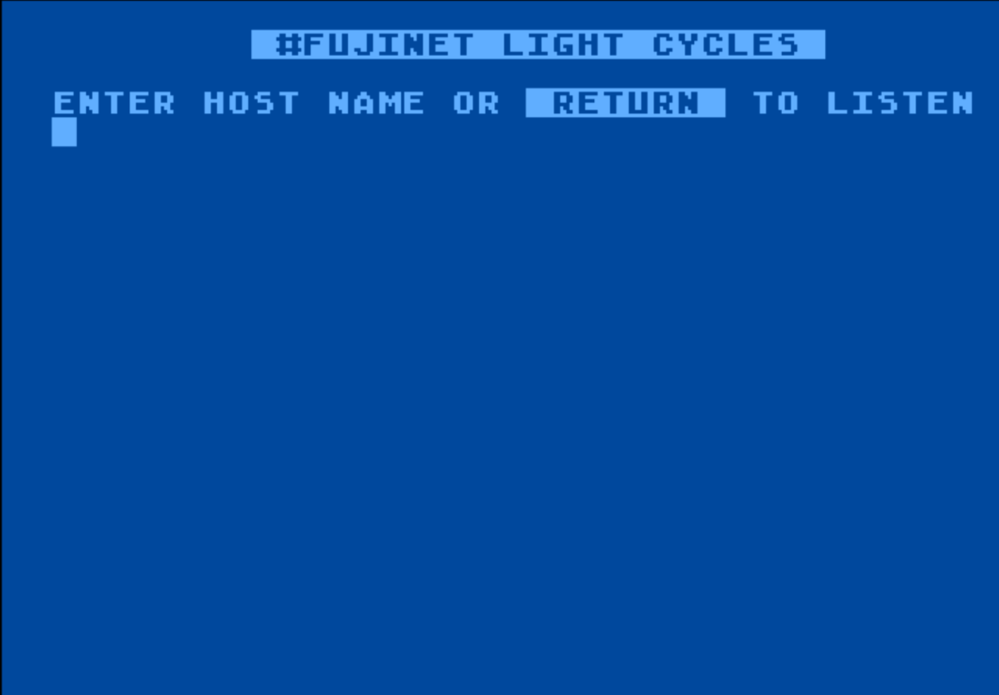

# `fujinet-apps`

This section of the "FujiNetWiFi" Git project contains applications,
demos, and sample programs for the #FujiNet device.

Details in this README last updated 2022-08-16.

Some applications are generic terminals, for connecting to
servers (e.g., `netcat` and `PLATO`).  Others are clients for
talking to standard online services (like `twitter` and `iss-tracker`),
or #FujiNet-specific services (like `apod` and `news`;
code for some of those live at https://github.com/FujiNetWIFI/servers).
Finally, others are apps or demos that exercise other parts of the #FujiNet
device (e.g., `appkey-sample` and `LiteSAM`).

----------------------------------------------------------------------

## Atari 8-bit

Generally, compiled executable programs (something written in assembly
or C) are likely to work best if you disable built-in BASIC while booting
your Atari (hold `[OPTION]` on XL and XE models).

**FIXME:** It would be good to know the specific RAM requirements of these apps.

### Atari 8-bit Terminals

#### `adm3a`
This is a simple version of netcat with ADM-3A terminal emulation
(see https://en.wikipedia.org/wiki/ADM-3A)

#### `netcat-action`, `netcat-asm`
Netcat examples in Action! and 6502 assembly (see also `netcat`, below).
(similar to the idea of https://en.wikipedia.org/wiki/Netcat)

#### `vt100` (Work in Progress)
DEC VT100 emulator that uses N:

### Atari 8-bit Internet Clients

#### `apod`
Astronomy Photo of the Day viewer (https://apod.nasa.gov/apod/astropix.html)

#### `election2020` (Outdated)
US election tracker

#### `twitter` (Work in Progress)
A Twitter client for #FujiNet.

### Atari 8-bit Apps

#### `LiteSAM`
A handler that can be loaded at boot in any Atari DOS, to redirect
the screen editor (E:) device output to also go to #FujiNet's built-in
S.A.M. speech synthesizer, essentially giving you a screen reader

#### `Lobby`
The FujiNet Game Lobby Client displays a real time list of online game servers. Choose a server and the Lobby will download and mount the correct client and reboot, so you can play! The goal is to expand this to all platforms.

#### `RA8`, `RA8KEY`, `RA8-win` (Work in progress)
Remote Atari 8-bit 
A poor man equivalent of remote desktop on windows, but for the Atari 8-bit system.
RA8KEY - allows you to type on the Atari using your Windows machine
RA8    - allows you to type and display the text screen on your windows machine
RA8-win- Windows user interface

### Atari 8-bit Games

#### `Capture_the_Flag` (Work in Progress)
This is a version of Sirius Software's "Capture the Flag" that is being
adapted to run over #FujiNet as an example of adapting existing machine
language games.

### Atari 8-bit Samples

#### `boot-disk-cc65-template`
An example project that creates a single density (90K boot disk) that runs a program.

#### `cookies`
Small C program that connects to a webserver, interacts in a way that
causes an HTTP web cookie to be set, stores the cookie, and then connects
again, sending the cookie back. Uses #FujiNet AppKey storage to record
the cookie.

----------------------------------------------------------------------

## Coleco ADAM

### Coleco ADAM Internet Clients

#### `news`
News reader client and "FujiNews", news article fetch & store server for FujiNet.

----------------------------------------------------------------------

## Atari Lynx

### Atari Lynx Samples

#### `fujinet-lynx-launch`
**FIXME:** What is this?

----------------------------------------------------------------------

## Apple II

### Apple II Samples

#### `clock`
Small C program to demonstrate how to access the FujiNet RTC directly or via
the ProDOS driver

----------------------------------------------------------------------

## Cross-Platform

### Cross-Platform Terminals

#### `netcat`
Netcat example in C
(similar to the idea of https://en.wikipedia.org/wiki/Netcat)

Platforms: Atari 8-bit, Apple II

#### `PLATOTERM`
A version of the PLATO terminal for IRATA.ONLINE, pre-configured to connect to IRATA.ONLINE.
For accessing PLATO ("Programmed Logic for Automatic Teaching Operations") (aka CYBIS) systems.
(see https://en.wikipedia.org/wiki/PLATO_(computer_system))

### Cross-Platform Internet Clients

#### `iss-tracker`

International Space Station (ISS) Tracker for #FujiNet.
View the current position of the International Space Station over the
earth, track some of it's upcoming positions, and even see how many
people are in space, and who they are.

Platforms: Atari 8-bit, ADAM, Apple II, Lynx

#### `mastodon`
A client to connect to a Mastodon microblogging (Twitter-like)
service.
(See https://en.wikipedia.org/wiki/Mastodon_(software))

Platforms: Atari 8-bit, ADAM

#### `wiki`
FujiNet Wikipedia Article Viewer.  This app uses a custom API on top of
the Wikipedia API to fetch and parse articles from Wikipedia.

Platforms: Atari 8-bit, ADAM

### Cross-Platform Games

#### `connect-four`
Connect-Four game for two players over a network.

Platforms: Atari 8-bit, ADAM

#### `lightcycles`
Tron inspired game, try and get your opponent to crash into the wall 
you created.

Platforms: Atari 8-bit, Apple II

#### `reversi`
Classic game

Platforms: Atari 8-bit, Apple II

### Cross-Platform Apps

#### `restore-image`
Copy an image to a target disk. (**FIXME**: Needs a clearer description)

### Cross-Platform Samples

#### `appkey-sample`
CC65 sample code to write and read a #FujiNet App Key
(see https://github.com/FujiNetWIFI/fujinet-platformio/wiki/SIO-Command-$DC-Open-App-Key)

Platforms: Atari 8-bit, ADAM

#### `json-test`

A test program showing how to use the JSON parsing functions to traverse live data from e.g. HTTPS.

Platforms: Atari 8-bit, ADAM
